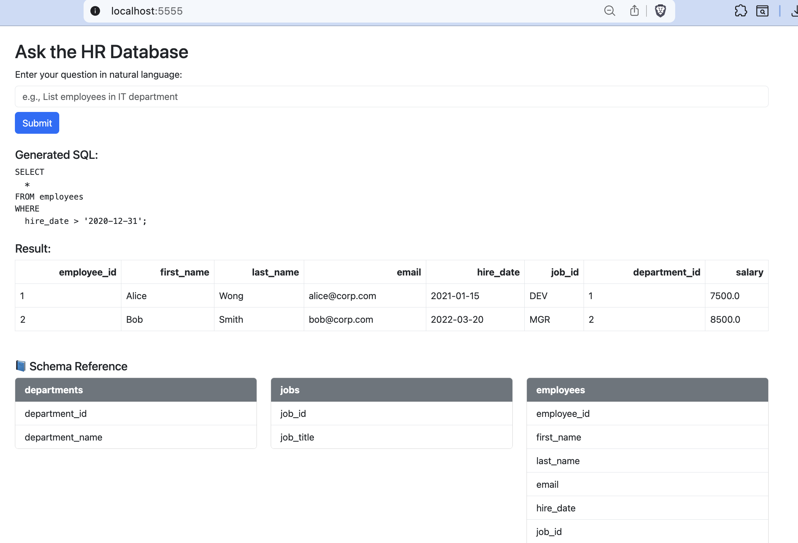

# Natural Language to SQL with Flask and Gemini

This is a simple web application that converts natural language questions into SQL queries using Google's Gemini Pro model. The application is built with Flask and uses a SQLite database. The user interface is styled with Bootstrap.

## Features

*   **Natural Language to SQL:** Ask questions in plain English and get SQL query results.
*   **Gemini Integration:** Leverages the power of Google's Gemini Pro model for accurate NL-to-SQL conversion.
*   **Bootstrap UI:** A clean and simple user interface with dropdowns to view table schemas.
*   **SQLite Database:** Comes with a sample HR database (`hr.db`) with pre-filled data.
*   **Dockerized:** Includes a `Dockerfile` and `requirements.txt` for easy containerization and deployment.

## Project Structure

```
.
├── app
│   ├── app.py          # Main Flask application
│   ├── hr.db           # SQLite database
│   ├── init.sql        # SQL script to initialize the database
│   └── templates
│       └── index.html  # HTML template for the UI
├── Dockerfile
├── requirements.txt
└── README.md
```

## Setup and Running

### Install dependencies

```bash
pip install -r requirements.txt
```

### Set up environment variables

Create a `.env` file in the root of the project and add your Gemini API key:

```
GEMINI_API_KEY="YOUR_GEMINI_API_KEY"
```

### Run the application

```bash
python app/app.py
```

The application will be running at `http://localhost:5555`.

## Screenshot



## Running with Docker Compose

With Docker and Docker Compose installed, you can run the application with a single command. Make sure you have your `.env` file with the `GEMINI_API_KEY` in the root of the project.

```bash
docker-compose up -d
```


